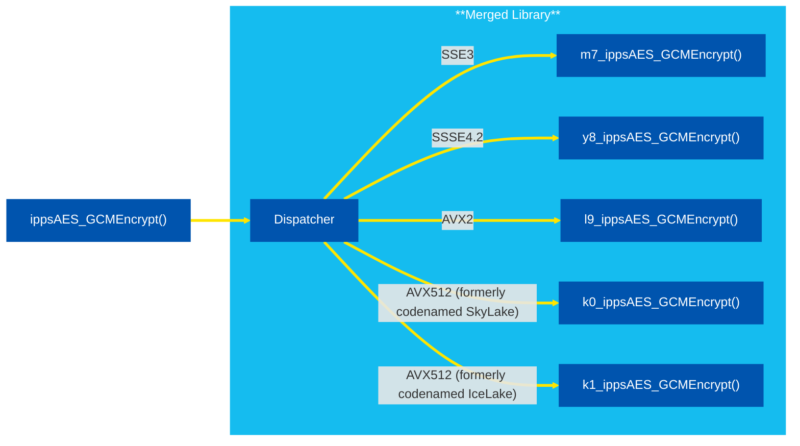
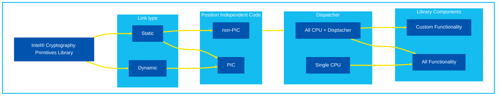
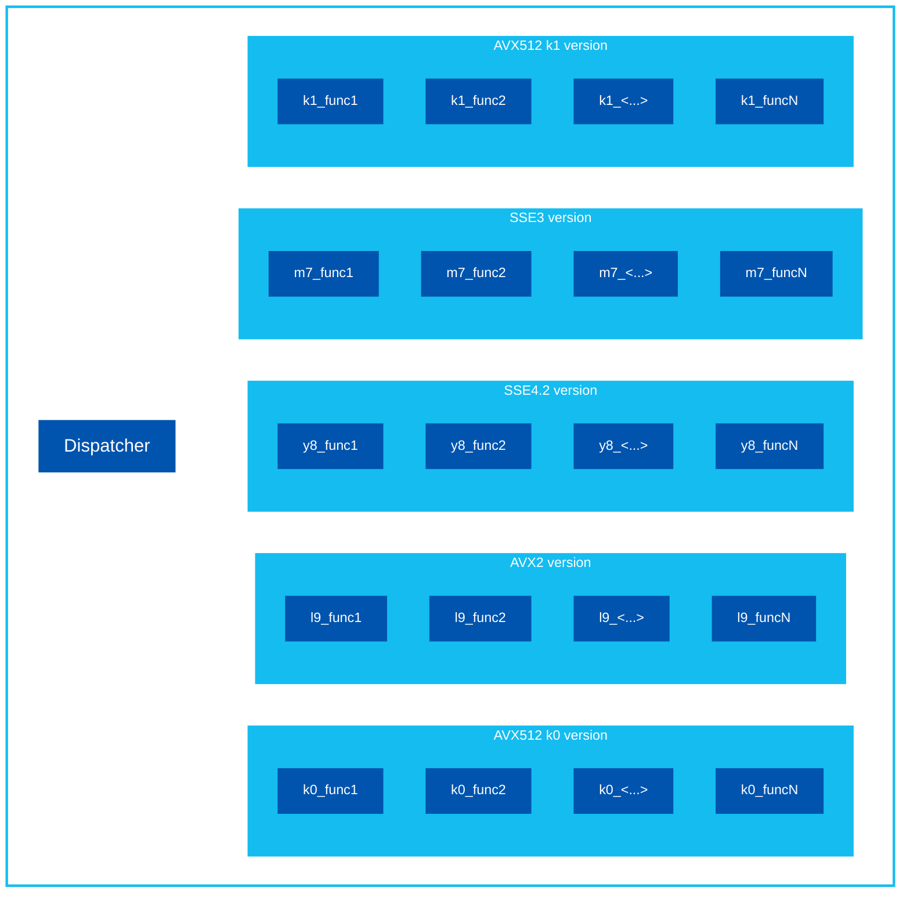

# Intel® Cryptography Primitives Library Overview <!-- omit in toc -->

- [Repository Structure](#repository-structure)
  - [Branches Description](#branches-description)
- [Dispatcher](#dispatcher)
  - [CPU Dispatching](#cpu-dispatching)
    - [Target Optimization Codes in Function Names](#target-optimization-codes-in-function-names)
  - [CPU Feature Dispatching](#cpu-feature-dispatching)
  - [How to Avoid Dispatcher in All CPUs Static Library](#how-to-avoid-dispatcher-in-all-cpus-static-library)
- [Library Configurations](#library-configurations)
  - [Linkage Mode](#linkage-mode)
  - [Code Position](#code-position)
  - [Target Instruction Set Architecture (ISA)](#target-instruction-set-architecture-isa)
    - [All CPUs Library](#all-cpus-library)
    - [Specific ISA Library](#specific-isa-library)
    - [Choosing specific ISA from the All CPUs Static Library](#choosing-specific-isa-from-the-all-cpus-static-library)
  - [Functionality](#functionality)
    - [Static Library with Custom functionality](#static-library-with-custom-functionality)
    - [Dynamic Library with Custom functionality](#dynamic-library-with-custom-functionality)

<!-- Images List -->
[sha256-dispatching]: ./data/images/README-pictures-0-dispatcher.png  "Intel® Cryptography Primitives Library function dispatching scheme"
[library configurations]: ./data/images/README-pictures-1-library-configurations.png  "Library configurations picture"
[build targets]: ./data/images/README-pictures-1a-build-targets.png  "Build targets picture"
[merged library]: ./data/images/README-pictures-2-merged-library.png  "Merged library scheme"
[CPU-specific libraries]: ./data/images/README-pictures-3-cpu-specific-libraries.png  "CPU-specific libraries scheme"
[link-with-merged-library]: ./data/images/README-pictures-4a-1CPU.png  "Link with Merged Library picture"
[1cpu-link-with-merged-library]: ./data/images/README-pictures-4b-1CPU.png  "1CPU link with Merged Library picture"
<!-- End of Images List -->

## Repository Structure

``` bash
├── data/images
├── examples                                 < Examples of the library usage
├── include                                  < Public headers
├── sources
│   ├── cmake                                < OS-specific CMake files
│   │   ├── linux
│   │   ├── macosx
│   │   └── windows
│   ├── dispatcher                           < CPU dispatcher generator
│   ├── gen_cpu_spc_header                   < Single CPU headers generator
│   ├── include                              < Internal headers
│   └── ippcp                                < C-sources
│       ├── asm_ia32                         < IA-32 Assembler sources
│       ├── asm_intel64                      < Intel® 64 Assembler sources
│       ├── crypto_mb                        < Sources of the Crypto Multi-buffer library
│       ├── fips_cert
│       ├── gfpec
│       ├── hash
│       ├── lms
│       └── xmss
├── tools
|   └── ipp_custom_library_tool_python       < Custom Library Tool
├── .clang-format
├── .clang-tidy
├── BUILD.md
├── CHANGELOG.md
├── CMakeLists.txt                           < Main CMake file
├── CONST_TIME_EXECUTION_TESTING.md          < Information about security testing
├── CONTRIBUTING.md
├── DEPRECATION_NOTES.md
├── LICENSE
├── OVERVIEW.md
├── README.md
├── README_FIPS.md                           < FIPS compliance guide
├── SECURITY.md
├── SUPPORT.md
└── THIRD-PARTY-PROGRAMS.txt
```

### Branches Description

- `develop` - snapshots of the library under active development.
Contains code that may not be fully functional and that Intel may substantially modify in development of a production version.
- `ipp_crypto_<release>` - source code of the official production release `<release>`.

## Dispatcher

### CPU Dispatching

For the best performance, Intel® Cryptography Primitives Library uses multiple implementations of each function, optimized for various CPUs, and the [library version targeted for any CPU](#all-cpus-library) contains all of these implementations.

With the dispatcher, the library detects an available CPU in a runtime and chooses the best for the current hardware version of a function. The process of dispatching is transparent and you can always call a generic function as illustrated at the picture below.



The prefix before the function name ("m7_", "y8_", etc) is a naming convention for the function implementations that are included in the [library with dispatcher](#all-cpus-library). It refers to the CPU instruction set for which the function is optimized (for all available prefixes see the [table](#target-optimization-codes-in-function-names) below).

The dispatcher is designed to add no performance overhead when the library is initialized, in other words, when CPU features are detected. You can initialize the library either explicitly in advance by calling the dedicated function [ippcpInit()](https://www.intel.com/content/www/us/en/docs/ipp-crypto/developer-reference/current/init.html) or it will be done implicitly during the first call of any function of the library.

By default, the dispatcher chooses the most appropriate optimization for the current hardware, but it is possible to apply the user-chosen one using the [ippcpSetCpuFeatures()](https://www.intel.com/content/www/us/en/docs/ipp-crypto/developer-guide-oneapi/current/support-functions.html) function.

#### Target Optimization Codes in Function Names

| IA-32 Intel® architecture | Intel® 64 architecture | Meaning                                                                                                            |
| ------------------------- | ---------------------- | ------------------------------------------------------------------------------------------------------------------ |
| px                        | mx                     | Generic code without hardware specific optimizations suitable for any CPU                                          |
| w7                        | -                      | Optimized for processors with Intel® Streaming SIMD Extensions 2 (Intel® SSE2)                                     |
| -                         | m7                     | Optimized for processors with Intel® SSE3                                                                          |
| p8                        | y8                     | Optimized for processors with Intel® SSE4.2                                                                        |
| h9                        | l9                     | Optimized for processors with Intel® Advanced Vector Extensions 2 (Intel® AVX2)                                    |
| -                         | k0                     | Optimized for processors with Intel® Advanced Vector Extensions 512 (Intel® AVX-512) (formerly codenamed SkyLake)  |
| -                         | k1                     | Optimized for processors with Intel® Advanced Vector Extensions 512 (Intel® AVX-512) (formerly codenamed IceLake)  |

> **NOTE:** Due to the significant shift in the industry towards 64-bit architecture, the support of 32-bit libraries is deprecated in the Intel® Integrated Performance Primitives Cryptography (Intel® IPP Cryptography) 2021.9 release. No new features (only critical security fixes) are targeted for 32-bit libraries and testing scope is limited by Linux OS & Clang compiler.

### CPU Feature Dispatching

Besides CPU dispatching that lets the library choose the general instruction set targeted implementation (for example, Intel SSE4.2, Intel AVX-512, and others), there is more granular dispatching that allows configuring usage of particular CPU features within a single instruction set. For example, Intel AVX-512 instruction set contains a VAES (AES Vector Extensions) feature subset, but not all CPUs that have Intel AVX-512 on board support VAES, so the library can automatically detect it in a runtime and enable corresponding optimizations if the feature subset is available.

List of CPU feature subsets that the library has special optimizations for:

- Intel ADX (ADCX, ADOX)
- Intel® Advanced Encryption Standard New Instructions (Intel® AES-NI)
- Intel® Secure Hash Algorithm - New Instructions (Intel® SHA-NI)
- RDRAND
- RDSEED
- CLMUL
- Intel AVX-512/AVX2 VAES
- Intel AVX-512 IFMA
- Intel AVX-512 GFNI
- SM3-NI

 > **NOTE:** For some features there is also an opportunity to force their dispatching inside the 1CPU libraries manually during the compile time. For more information please, refer to [common for all operating systems CMake build options](./BUILD.md/#common-for-all-operating-systems).

### How to Avoid Dispatcher in All CPUs Static Library

To leave only specific ISA when linking with an [All CPUs Static Library](#all-cpus-library) and drop dispatcher, please refer to [this section](#choosing-specific-isa-from-the-all-cpus-static-library).

## Library Configurations

The Intel® Cryptography Primitives Library supports configurations by:

1) [*Linkage Mode*](#linkage-mode): to produce a static or dynamic library

2) [*Code Position*](#code-position): to make position independent code (PIC) or non-PIC library

3) *Target Instruction Set Architecture (ISA)*:
    - [All CPUs Library](#all-cpus-library)
    - [Specific Instruction Set (ISA) Targeted Library](#specific-isa-library)
    - [Choosing specific ISA from the All CPUs Static Library](#choosing-specific-isa-from-the-all-cpus-static-library)

4) *Functionality*:
    - [Library with All functionality](#functionality)
    - [Static Library with Custom functionality](#static-library-with-custom-functionality)
    - [Dynamic Library with Custom functionality](#dynamic-library-with-custom-functionality)

All possible configuration combinations are shown in the picture below.




### Linkage Mode

The build system is designed to create a dynamic library from the static one, so both build targets for dynamic and static libraries are always generated during CMake phase.

The corresponding build target names for the libraries are shown at the picture below (same target names can be used on Linux* OS in the `make` command as well).

![Build targets picture][build targets]

### Code Position

Be default, the Intel® Cryptography Primitives Library is built with the [Position Independent Code (PIC)](https://en.wikipedia.org/wiki/Position-independent_code) option.

But on Linux* OS, when the library is supposed to work in kernel space, it is possible to compile the static library in a non-PIC mode. For more information about build options, refer to the [Linux* OS build options](./BUILD.md).

### Target Instruction Set Architecture (ISA)

#### All CPUs Library

Each function of the library is built in several instances with optimizations for each supported instruction set (see example for the `func2` function in green). Those functions instances are all included into a single library along with the [dispatcher](#dispatcher) that lets the library choose right function instance depending on current CPU. Such library build is called a merged library build.



The advantage of this configuration is that the library works on any CPU.

CMake build option: `-DMERGED_BLD:BOOL=on`

#### Specific ISA Library

The build system produces several separate libraries each optimized for its own instruction set. In this case, there is no need in [CPU dispatcher](#cpu-dispatching), so the dispatcher is not included, although [features dispatching](#cpu-feature-dispatching) within a single instruction set is in place.

To specify for what instruction set targeted libraries must be produced, use the `PLATFORM_LIST` CMake variable. It contains semicolon-delimited list of CPU codes (for the complete list of codes see the table in [this](#target-optimization-codes-in-function-names) section).

> **NOTE:** Platforms n8 (optimized for processors with Supplemental Streaming SIMD Extensions 3 (SSSE3)) and e9 (optimized for processors with Intel® Advanced Vector Extensions (Intel® AVX)) have been deprecated but are still supported in the specific ISA library build. Support for these platforms is targeted to be removed in a future release.

For example, to create two libraries - one with SSE4.2 optimizations and another with Intel AVX-512 optimizations, specify `-DPLATFORM_LIST="y8;k0"`.

![CPU specific libraries picture][CPU-specific libraries]

The advantage of this configuration is that libraries that contain function versions optimized for only one instruction set have much smaller footprint size than a big merged library. But the price of this advantage is that such libraries only work on a CPU that supports a corresponding instruction set.

CMake build options: `-DMERGED_BLD:BOOL=off -DPLATFORM_LIST="<platform_list>"`

#### Choosing specific ISA from the All CPUs Static Library

When application is being statically linked with All CPUs Static Library, it receives functions implementations for all instruction sets with corresponding [dispatcher](#dispatcher) routines. This works well when CPU, where an application is going to work, is unknown.

![Link with Merged Library picture][link-with-merged-library]

But when target CPU is defined, it is possible to take from the static library only required instruction set implementations and avoid [dispatcher](#dispatcher) inclusion.

![1CPU link with Merged Library picture][1cpu-link-with-merged-library]

For this purpose, there are several CPU-specific headers (each targets a specific CPU optimization) generated during the merged library build. They are located in the `<build_dir>/.build/<RELEASE|DEBUG>/include/autogen` directory.

To enable linking of CPU-specific versions of the library functions, include the appropriate header from the directory above before the primary library header `ippcp.h`.

It is important to ensure that both processor and operating system supports full capabilities of the target processor.

### Functionality

By default, Intel® Cryptography Primitives Library (both static and dynamic libraries) contain all functionality that exists in the product. But when footprint size matters, the library can contain only required functionality and have no unused code.

#### Static Library with Custom functionality

With the static linking having only required functionality in the library is not so actual as leaving only those parts of a library that are used by application, is automatically managed by linker.

Considering Intel® Cryptography Primitives Library design that implies minimal internal dependencies, the application linked with the static Intel® Cryptography Primitives Library contains only relevant library functionality, and has minimal footprint size.

#### Dynamic Library with Custom functionality

To build your own dynamic library containing only the functionality that is necessary for your application, you can use the Intel® IPP Custom Library Tool - a Python tool that consumes pre-built merged (all CPUs) static library to produce a tiny dynamic library.

The tool is located in the `tools/ipp_custom_library_tool_python` directory.

Please refer to the [tool documentation](https://www.intel.com/content/www/us/en/docs/ipp/developer-guide-reference/current/ipp-custom-library-tool.html) for more information.
